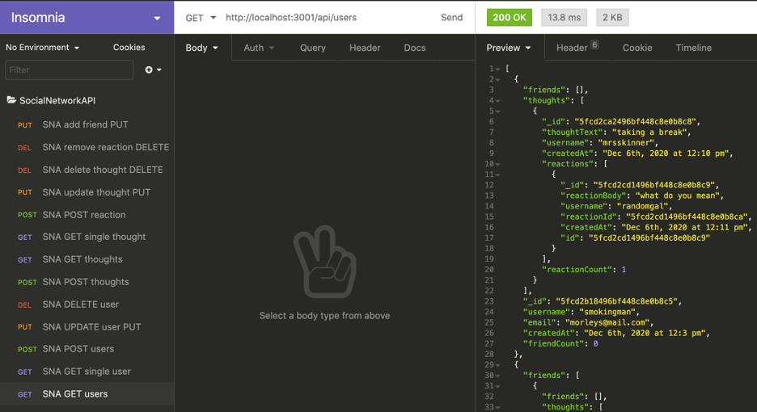

# SocialNetworkAPI

## Description 
The Social Network API is an app that focuses on MongoDB, Mongoose and Express for testing server routes. With the MVC in mind, you can create users, have thoughts on users posts, and react to thoughts. You will be able to update and delete users and thoughts. The use of Insomnia Core will help visualize testing routes and making requests to the server. There will also be virtuals as to friend counts and reaction counts.

## Table of Contents 
* [Installation](#installation)
* [Usage](#usage)
* [Credits](#credits)
* [License](#license)

## Installation 
Once the GitHub repo is cloned to your local files, in the command line you will install the Node.js packages of Express and Mongoose. MongoDB should already be downloading and running on your operating system. .gitignore the node packages

## Usage 
To start the server in your command line when you are in the root directory, type "node server" or "node server.js". Then open Insomnia Core and test the routes with the Local Host url and appropriate endpoints.

### Demo Video
Watch this video to see the server and routes in action:

https://youtu.be/C8sydm6zqKk

    
## Credits 
UofA Coding Bootcamp

## License 
Node.js, Express, Mongoose, MongoDB, Insomnia Core

## Contributing 
There is no contributing at this time. 

